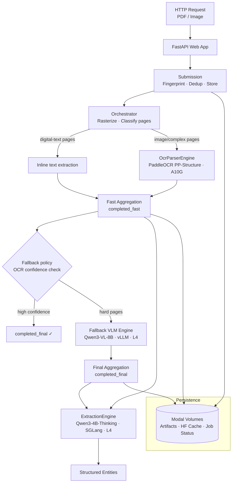

# modal_doc_parsing_vlm

OCR-first document parsing on Modal with staged results, selective VLM fallback, and a split extraction stack.

## What It Does

Accepts PDFs or images via HTTP, rasterizes and classifies each page, then routes pages through a two-stage pipeline: PaddleOCR (fast, A10G) followed by selective Qwen3-VL-8B fallback (accurate, L4) for pages where OCR confidence is low. Results are written at two stages — `completed_fast` (OCR result) and `completed_final` (after VLM refinement) — so callers can stream progressive output. Entity extraction runs in parallel on a separate SGLang server, keeping the parsing and extraction GPU pools independent.

## Architecture



## Key Design Decisions

- **Staged results** — `completed_fast` is published before VLM refinement starts; clients don't wait for the full pipeline
- **OCR → VLM routing** — only pages that fail the OCR confidence threshold are sent to the VLM fallback, keeping GPU spend proportional to document complexity
- **GPU cost split** — OCR runs on A10G (throughput-optimized); VLM fallback and extraction each run on L4 (cost-optimized for smaller models)
- **Chunked batching** — pages are grouped into chunks before dispatch so each worker call is a single batched `LLM.chat(...)`, not one request per page
- **Request idempotency** — identical bytes + payload fingerprint reuse an existing job, making retries and benchmark reruns safe
- **Split extraction stack** — entity suggestion plus default whole-document and per-page extraction share a single online SGLang server; the dedicated per-page batch engine is opt-in via `DOC_PARSE_USE_DEDICATED_EXTRACTION_BATCH_ENGINE=1`

## Stack

| Layer | Technology |
|---|---|
| Deployment | [Modal](https://modal.com) |
| OCR / layout | PaddleOCR PP-StructureV3 · A10G |
| VLM fallback | Qwen3-VL-8B-Instruct-FP8 · vLLM · L4 |
| Extraction | Qwen3-4B-Thinking-2507-FP8 · SGLang · L4 |
| Web API | FastAPI (ASGI via Modal) |

## Quick Start

```bash
python3.12 -m venv .venv && source .venv/bin/activate
pip install -e ".[dev]"
./scripts/build_frontend.sh
./.venv/bin/modal deploy app.py
```

For a non-default environment: `./.venv/bin/modal deploy app.py -e <env>`

## Docs

- [Architecture & lifecycle details](/docs/architecture.md)
- [Configuration & environment knobs](/docs/configuration.md)
